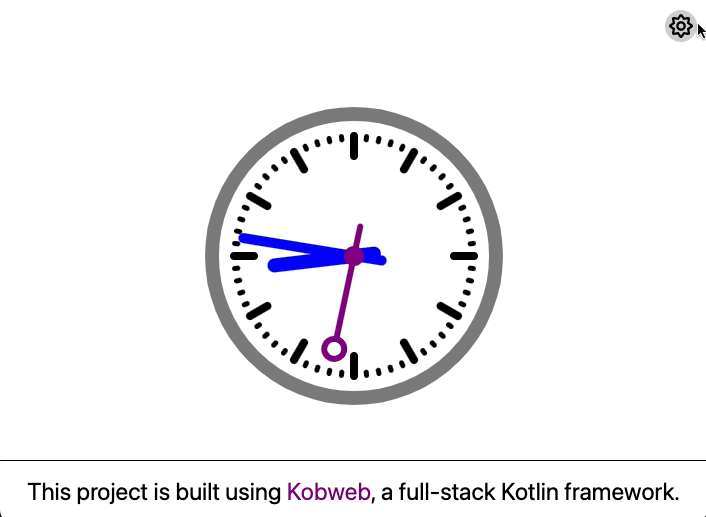

# Clock

This is a [Kobweb](https://github.com/varabyte/kobweb) project instantiated from the `examples/clock` template.

It is a Kotlin implementation of the tutorial
[shared by Mozilla](https://developer.mozilla.org/en-US/docs/Web/API/Canvas_API/Tutorial/Basic_animations#an_animated_clock).

The purpose of this project is to demonstrate the `Canvas` composable as well as color mode awareness.

---

To run the sample, simply enter the following command in the terminal:

```bash
kobweb run
```

and open [http://localhost:8080](http://localhost:8080) with your browser to see the result.
